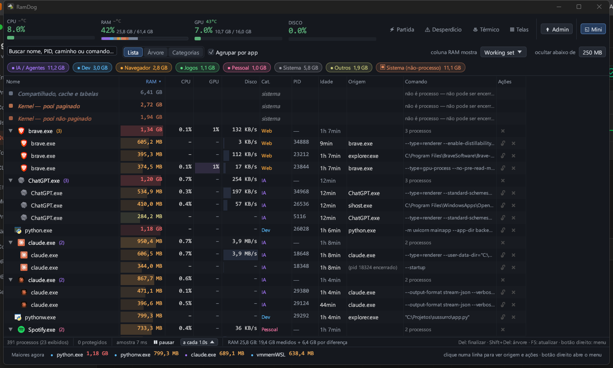

<p align="center">
  
</p>

<h1 align="center">RamDog</h1>

<p align="center">
  Gerenciador de processos para Windows: origem, categorias, kill de árvore e ralos.
</p>

<p align="center">
  
  
  
</p>



## Por que existe

O Gerenciador de Tarefas não mostra a cadeia de origem — quem lançou o processo. Não classifica IA, Dev ou Navegador. Não mata a árvore inteira com lock no que não pode cair. Não trata os ralos do Windows.

Este app existe por isso.

## O que faz

- **Origem / lançado por.** Coluna Origem = primeiro ancestral vivo que não seja host genérico (`cmd`, `bash`, `node`…). Quando a cadeia de pais morreu, o RamDog lê o ambiente herdado e mostra em roxo o agente (Claude Code + sessão + PID, Codex, Cursor Agent, Gemini CLI…) e o host (Maestri, VS Code, Cursor, Windows Terminal…), além de `npm run <script>` no projeto.
- **Categorias.** IA / Agentes, Dev, Navegador, Jogos, Pessoal, Sistema, Outros — regra automática, com override manual por processo.
- **Kill, árvore e lock.** Finaliza o processo ou a árvore (processo + filhos). Lock impede que o RamDog encerre o protegido. Processos críticos do Windows (`System`, `csrss`, `wininit`, `dwm`, …) são sempre protegidos.
- **Visões.** Lista (plana), Árvore (pai → filhos, RAM da subárvore), Categorias (agrupado), Ralos (o que o Windows consome sem você pedir).
- **Medidores.** CPU, RAM, GPU e disco no topo; os mesmos eixos por processo na tabela.

## Instalar

**Windows x64** (PowerShell):

```powershell
irm https://raw.githubusercontent.com/LucasOl1337/RamDog/main/install.ps1 | iex
```

Depois: `ramdog` no terminal, ou o atalho **RamDog** na área de trabalho (UAC = temperatura da CPU).

**macOS** (Apple Silicon ou Intel):

```bash
curl -sSfL https://raw.githubusercontent.com/LucasOl1337/RamDog/main/install.sh | sh
```

No Mac: lista, categorias, origem, árvore, kill. Sem ralos do Windows, sem temp de CPU (LibreHardwareMonitor) e sem GPU NVIDIA/NVML. Se ainda não houver release macOS, o script compila do source (precisa [rustup](https://rustup.rs) + git).

[Release](https://github.com/LucasOl1337/RamDog/releases) com zip/tar, se preferir baixar na mão.

Do código:

```bash
git clone https://github.com/LucasOl1337/RamDog.git
cd RamDog
cargo build --release
```

Windows, helper de temperatura (opcional, [SDK .NET 8](https://dotnet.microsoft.com/download/dotnet/8.0)):

```bash
dotnet publish hwtemp -c Release -o target/release --no-self-contained
```

## Uso

| Ação | Como |
|---|---|
| Finalizar processo | ✖ na linha, `Del`, botão direito → Finalizar, ou painel inferior |
| Finalizar árvore (processo + filhos) | `Shift+Del`, `Shift`+✖, botão direito → Finalizar árvore, ou painel inferior |
| Proteger / desproteger | 🔒/🔓 na linha, botão direito, ou painel inferior. Protegidos nunca são finalizados pelo RamDog |
| Categoria manual | botão direito → Categoria, ou combo no painel inferior (`auto` volta à regra automática) |
| Visões | **Lista** (plana), **Árvore** (pai → filhos, RAM da subárvore), **Categorias** (agrupado), **Ralos** (Windows) |
| Filtro | busca por nome / PID / comando; chips de categoria (clique alterna, duplo clique isola); `min. MB` |
| Origem | coluna *Origem* = primeiro ancestral vivo que não seja host genérico (cmd, bash, node...); cadeia completa clicável no painel inferior (`Ir para o pai`) |
| Lançado por | quando a cadeia de pais morreu (ou só tem hosts genéricos), o RamDog lê as variáveis de ambiente herdadas do processo e mostra em roxo quem o originou: agente (Claude Code + sessão + PID, Codex, Cursor Agent, Gemini CLI...) e host (Maestri, VS Code, Cursor, Windows Terminal...), além de `npm run <script>` em `<projeto>` |
| Atualização | 0,5–5 s, **Pausar**, `F5` força |

Enquanto o mouse está sobre a tabela a ordem das linhas fica **congelada** (status "ordem congelada"), para o clique em ✖ nunca cair numa linha que acabou de trocar de lugar. Com **Confirmar kill** ligado, todo encerramento pede confirmação (`Enter` confirma, `Esc` cancela) e lista os processos afetados.

Aba **Ralos**: leitura direta (SCM + registro, sem PowerShell). **Ação** usa Win32 direto quando o RamDog já está elevado; senão dispara um PowerShell elevado — **um prompt de UAC por ação**.

| Seção | O que dá para fazer | Reversível? |
|---|---|---|
| **Microsoft Defender** | Excluir pastas de projeto/agentes da varredura em tempo real (`Add-MpPreference -ExclusionPath`); limitar a CPU da varredura agendada para 5/10/20% (`-ScanAvgCPULoadFactor`); pausar/reativar a proteção em tempo real | Sim, tudo |
| **Serviços dispensáveis** | **Parar** (só agora) ou **Desativar** (não inicia mais) — WSearch, SysMain, DiagTrack, DoSvc, WerSvc, MapsBroker, PhoneSvc, Xbox*, lfsvc, RemoteRegistry, Fax. `wuauserv` é só *parar* (o Windows o religa sozinho) | Sim, botão **Reativar** |
| **Apps de sistema (Appx)** | Remover pacotes de sistema que você não usa | Reinstalável pela Store |
| **Inicialização** | Ligar/desligar entradas do `Run` (HKCU e HKLM) e **remover** de vez; **Finalizar** o processo se já estiver rodando | Ligar/desligar sim; remover, não |

## Limites

- `MsMpEng.exe` (Defender) é **processo protegido pelo kernel**: nem como admin dá para finalizar, e o serviço `WinDefend` não aceita `stop`. A seção do Defender só oferece formas de **reduzir o trabalho** dele — não de matá-lo. `WinDefend`, `WdNisSvc` e `MDCoreSvc` aparecem listados, mas sem botão.
- Com **Tamper Protection ligada**, `Set-MpPreference -DisableRealtimeMonitoring` é silenciosamente revertido pelo Windows. O estado atual aparece no chip *tamper protection* — se estiver `ligado`, pausar tempo real não vai pegar.
- Processos de outros usuários / serviços elevados só podem ser finalizados como admin: botão **Reabrir como admin** na barra superior (UAC). Sem admin, cada ação de ralo abre um UAC; com admin, serviço e registro rodam direto.
- Temperatura de CPU/RAM só aparece com o RamDog elevado (o helper `hwtemp.exe` herda o token, sem UAC extra). Sem helper, sem admin, ou placa sem Super I/O suportado, a UI mostra "–".
- GPU no topo e na tabela **só funciona com NVIDIA** (`nvml.dll`). Sem driver/NVML, mostra "–" — nunca inventa número.
- Configuração: `%APPDATA%\RamDog\config.json` (locks, categorias manuais, intervalo, filtro mínimo, visão). Salvo automaticamente.

## Como mede

- RAM por processo = *Private Working Set* (a mesma métrica da coluna Memória do Gerenciador de Tarefas), via `NtQuerySystemInformation`.
- CPU no topo = `GetSystemTimes` (kernel+usuário / tempo decorrido).
- GPU via NVML (`nvml.dll` carregado dinamicamente): uso, temperatura, VRAM, potência e cooler. Por processo, PDH `\GPU Engine(*)\Utilization Percentage`, **máximo entre as engines** do PID (não soma).
- Disco no topo = PDH `\PhysicalDisk(_Total)\% Idle Time` (100 − ocioso) e throughput `\PhysicalDisk(_Total)\Disk Bytes/sec`, sistema inteiro. Coluna por processo = bytes lidos+escritos/s (`IO_COUNTERS`) — grandeza diferente; os dois números não precisam bater.
- Contadores PDH com `PdhAddEnglishCounterW` (nomes em inglês, não localizados). No Windows pt-BR os caminhos traduzidos não existem; a API em inglês funciona em qualquer idioma.
- `hwtemp.exe` é um helper .NET opcional (LibreHardwareMonitorLib) que lê Tctl/Tdie da CPU e sensores DIMM da placa-mãe. O RamDog nunca inventa esses números.

## Licença

[MIT](LICENSE).

## Também

[**TempHUD**](https://github.com/LucasOl1337/TempHUD) — overlay térmico para Windows.
