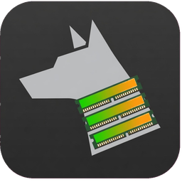

<p align="center">
  
</p>

<h1 align="center">RamDog</h1>

<p align="center">
  Gerenciador de processos para Windows e macOS: origem, categorias, kill de árvore.
</p>

<p align="center">
  
  
  
  
</p>


## Por que existe

O Gerenciador de Tarefas não mostra a cadeia de origem — quem lançou o processo. Não classifica IA, Dev ou Navegador. Não mata a árvore inteira com lock no que não pode cair. Não trata o desperdício do Windows.

Este app existe por isso.

## O que faz

- **Origem / lançado por.** Coluna Origem = primeiro ancestral vivo que não seja host genérico (`cmd`, `bash`, `node`…). Quando a cadeia de pais morreu, o RamDog lê o ambiente herdado e mostra em roxo o agente (Claude Code + sessão + PID, Codex, Cursor Agent, Gemini CLI…) e o host (Maestri, VS Code, Cursor, Windows Terminal…), além de `npm run <script>` no projeto.
- **Categorias.** IA / Agentes, Dev, Navegador, Jogos, Pessoal, Sistema, Outros — regra automática, com override manual por processo.
- **Kill, árvore e lock.** Finaliza o processo ou a árvore (processo + filhos). Lock impede que o RamDog encerre o protegido. Processos críticos do SO (`System`/`csrss`/`dwm` no Windows; `kernel_task`/`launchd`/`WindowServer` no macOS) são sempre protegidos.
- **Visões.** Lista (plana), Árvore (pai → filhos, RAM da subárvore), Categorias (agrupado) nas abas ao lado da busca. Os addons — **Partida**, **Desperdício**, **Térmico** e **Telas**, só no Windows — ficam longe delas, com o nome escrito no bloco de controles do canto superior direito: clicar troca o conteúdo da janela, clicar de novo volta para a lista de processos.
- **Agrupar por app.** Na visão Lista, processos do mesmo executável viram uma linha só — `chrome.exe (37)` — somando RAM, CPU, GPU e disco no cabeçalho, com **✖** que encerra o app inteiro. A chave é o caminho do executável, não o nome: dois `svchost.exe` de pastas diferentes nunca caem no mesmo grupo. App com um processo só não agrupa.
- **Coluna CPU que dá para ler.** A repartição é por `CycleTime` (contado a cada troca de contexto), não pelo tempo de kernel/usuário — que o Windows só cobra em fatias de 15,625 ms e joga inteira em quem estava rodando no tique, fazendo processo de rajada piscar entre 0% e 15%. O total repartido vem de `GetSystemTimes`, então a máquina afogada não dilui o culpado. Por cima, média móvel de τ = 1 s amarrada ao tempo, não à contagem de amostras: o topo da lista para quieto o tempo de você ler. O valor cru do último intervalo continua visível no tooltip.
- **Medidores.** CPU e RAM no topo nos dois SOs. GPU NVIDIA (NVML) e % de disco estilo Task Manager só no Windows.
- **Térmico.** O [TempHUD](https://github.com/LucasOl1337/TempHUD) embutido: sensores de CPU/GPU/RAM/placa-mãe, controle de fans SuperIO (% manual ou Auto/BIOS) e **ESTABILIZAR** — fans travados em 50% até 80 °C, rampa linear até 100% aos 92 °C, teto imediato a 95 °C. A curva roda no helper `hwtemp.exe`: se o RamDog cair, os fans voltam à BIOS sozinhos. Fans exigem admin; sem eles a visão mostra só as leituras.
- **Partida.** Tudo que sobe com o PC, não o recorte do Gerenciador de Tarefas: `Run` e `RunOnce` (HKCU, HKLM e Wow64), a pasta Iniciar inteira (`.lnk`, `.vbs`, `.cmd`), tarefas agendadas com gatilho de boot/logon, serviços automáticos, apps UWP, Winlogon e Active Setup.
- **Telas.** Mapa dos monitores em escala: arraste a janela de um monitor para outro, solte numa zona da grade (metades, terços, quadrantes, principal+2…) e ela encaixa. **Distribuir** espalha tudo que está num monitor pela grade escolhida. **Cenários** salvam o arranjo em fração da área de trabalho — não em pixel — então o preset sobrevive a troca de resolução, de escala e de monitor; ao aplicar, o que já está aberto é movido e o que falta é aberto e posicionado quando a janela aparece.
- **O que é isso, posso matar?** Ficha de 80 processos do Windows no painel de detalhes: o que faz, por que está aberto e o risco de encerrar — 🟢 seguro, 🟡 o Windows reabre sozinho, 🔴 derruba a sessão.
- **Assinatura digital.** O signatário vem do certificado (`WinVerifyTrust`), não do `CompanyName` do arquivo — que qualquer impostor preenche com "Microsoft Corporation". Verificado sob demanda, só no processo selecionado, fora da amostragem.
- **Modo mini.** Botão **◱ Mini** encolhe o app num HUD sem bordas com CPU, RAM, GPU e disco em 2×2, cada um com sua temperatura, mais os RPM dos fans e o **ESTABILIZAR**. Fica por cima das outras janelas (alterna no `topo`), arrasta pelo fundo, minimiza, e o duplo clique volta ao app inteiro. O modo é lembrado entre sessões.

## Instalar

**Windows x64** (PowerShell):

```powershell
irm https://raw.githubusercontent.com/LucasOl1337/RamDog/main/install.ps1 | iex
```

Depois: `ramdog` no terminal, ou o atalho **RamDog** na área de trabalho (UAC = temperatura da CPU).

**macOS** (Apple Silicon ou Intel):

```bash
curl -sSfL https://raw.githubusercontent.com/LucasOl1337/RamDog/main/install.sh | sh
```

Baixa o tar do [release](https://github.com/LucasOl1337/RamDog/releases) (`RamDog-macos-aarch64.tar.gz` ou `…-x86_64.tar.gz`) para `~/.local/bin/ramdog` e abre. Se o Gatekeeper bloquear: Ajustes → Privacidade e segurança → Abrir mesmo assim.

No Mac: lista, categorias, origem, árvore, kill. Sem Desperdício, sem Telas, sem temp de CPU, sem GPU NVML. Sem binário no release, o script cai no `cargo build` (precisa [rustup](https://rustup.rs) + git).

[Release](https://github.com/LucasOl1337/RamDog/releases) com zip (Windows) e tar (macOS), se preferir baixar na mão.

Do código:

```bash
git clone https://github.com/LucasOl1337/RamDog.git
cd RamDog
cargo build --release
```

Windows, helper de temperatura (opcional, [SDK .NET 8](https://dotnet.microsoft.com/download/dotnet/8.0)):

```bash
dotnet publish hwtemp -c Release -o target/release --no-self-contained
```

## Uso

| Ação | Como |
|---|---|
| Finalizar processo | ✖ na linha, `Del`, botão direito → Finalizar, ou painel inferior |
| Finalizar árvore (processo + filhos) | `Shift+Del`, `Shift`+✖, botão direito → Finalizar árvore, ou painel inferior |
| Proteger / desproteger | 🔒/🔓 na linha, botão direito, ou painel inferior. Protegidos nunca são finalizados pelo RamDog |
| Categoria manual | botão direito → Categoria, ou combo no painel inferior (`auto` volta à regra automática) |
| Visões | **Lista**, **Árvore**, **Categorias** nas abas ao lado da busca; **Partida**, **Desperdício**, **Térmico** e **Telas** com o nome escrito no bloco de controles do canto superior direito (só no Windows) — o botão aceso é a visão atual e clicar nele volta para a última visão de processo |
| Agrupar por app | caixa **Agrupar por app** na visão Lista; ▶/▼ recolhe e abre um grupo, **Expandir tudo** / **Recolher tudo** valem para a lista inteira; **✖** no cabeçalho encerra todos os processos daquele app |
| Filtro | busca por nome / PID / comando; chips de categoria (clique alterna, duplo clique isola); `ocultar abaixo de N MB`, no canto direito da fileira junto de `coluna RAM mostra` |
| Origem | coluna *Origem* = primeiro ancestral vivo que não seja host genérico (cmd, bash, node...); cadeia completa clicável no painel inferior (`Ir para o pai`) |
| Lançado por | quando a cadeia de pais morreu (ou só tem hosts genéricos), o RamDog lê as variáveis de ambiente herdadas do processo e mostra em roxo quem o originou: agente (Claude Code + sessão + PID, Codex, Cursor Agent, Gemini CLI...) e host (Maestri, VS Code, Cursor, Windows Terminal...), além de `npm run <script>` em `<projeto>` |
| Atualização | `⏸ pausar` e `a cada 0,5–5 s` no rodapé, ao lado do `amostra X ms` que eles produzem; `F5` força uma leitura |
| Modo mini | **◱ Mini** no canto superior direito. No HUD: `topo` alterna o sempre-por-cima, `–` minimiza, `⤢` (ou duplo clique no fundo) volta ao app inteiro, `✕` fecha; o botão de intervalo cicla 0,5 / 1 / 2 / 5 s; arrasta pelo fundo |

Encerrar é imediato: não há caixa de confirmação. Quem protege é o **lock** (🔒 no menu de contexto) — um processo travado não morre nem no `Del`, nem no ✖, nem no "finalizar árvore". E enquanto o mouse está sobre a tabela a ordem das linhas fica **congelada** (status "ordem congelada"), para o clique em ✖ nunca cair numa linha que acabou de trocar de lugar.

**Partida** (Windows): lista o que sobe no boot e no logon, com a origem de cada entrada (`Run`, pasta Iniciar, tarefa agendada, serviço, UWP, Winlogon, Active Setup), se já está rodando e o caminho real do executável. Ligar, desligar e remover valem para a entrada; o processo em si continua matável pela visão Lista. Entradas de máquina (HKLM, serviços, tarefas) precisam de admin — sem elevação o RamDog dispara um PowerShell elevado, **um prompt de UAC por ação**.

**Desperdício** (Windows): leitura direta (SCM + registro, sem PowerShell). **Ação** usa Win32 direto quando o RamDog já está elevado; senão dispara um PowerShell elevado — **um prompt de UAC por ação**. No macOS a visão existe só para dizer isso.

| Seção | O que dá para fazer | Reversível? |
|---|---|---|
| **Microsoft Defender** | Excluir pastas de projeto/agentes da varredura em tempo real (`Add-MpPreference -ExclusionPath`); limitar a CPU da varredura agendada para 5/10/20% (`-ScanAvgCPULoadFactor`); pausar/reativar a proteção em tempo real | Sim, tudo |
| **Serviços dispensáveis** | **Parar** (só agora) ou **Desativar** (não inicia mais) — WSearch, SysMain, DiagTrack, DoSvc, WerSvc, MapsBroker, PhoneSvc, Xbox*, lfsvc, RemoteRegistry, Fax. `wuauserv` é só *parar* (o Windows o religa sozinho) | Sim, botão **Reativar** |
| **Apps de sistema (Appx)** | Remover pacotes de sistema que você não usa | Reinstalável pela Store |
| **Inicialização** | Ligar/desligar entradas do `Run` (HKCU e HKLM) e **remover** de vez; **Finalizar** o processo se já estiver rodando | Ligar/desligar sim; remover, não |

**Telas** (Windows): o mapa desenha os monitores na proporção real, com a resolução de cada um e ★ no primário.

| Ação | Como |
|---|---|
| Mover janela de monitor | arraste o retângulo no mapa, ou os botões **→N** na lista (a fração ocupada é preservada no monitor de destino) |
| Encaixar na grade | com **encaixar ao arrastar** ligado, solte sobre a zona realçada da **Grade** escolhida (cheio, metades, deitadas, terços, quadrantes, principal+2, centro) |
| Distribuir | **Distribuir N** joga tudo que está no monitor N nas zonas da grade atual |
| Minimizar / maximizar | **—** e **▫** na lista de janelas abertas |
| Montar cenário | **+** na linha da janela adiciona o slot ao cenário selecionado; **Salvar atual** captura o arranjo inteiro; **Novo vazio** começa do zero |
| Aplicar cenário | **Aplicar** move o que já está aberto e, nos slots com **abrir** marcado, lança o que falta e posiciona quando a janela aparece (desiste após 25 s) |
| Casar a janela certa | **título contém…** desempata quando o mesmo executável tem várias janelas |

Os slots guardam posição em fração da **área de trabalho** do monitor, nunca em pixel — trocar de resolução, de escala ou de monitor não quebra o cenário. Se o monitor do slot sumiu, ele cai no primário. Ao posicionar, o RamDog desconta a sombra invisível da janela (`DWMWA_EXTENDED_FRAME_BOUNDS`), então metade da tela é metade de verdade, sem folga.

## Limites

**Os dois SOs**

- Processos de outros usuários: no Windows, **Reabrir como admin**; no macOS, `sudo ramdog` se precisar. A UI nunca inventa número — GPU/temp/disco ausentes aparecem "–".
- Configuração: Windows `%APPDATA%\RamDog\config.json`; macOS `~/Library/Application Support/RamDog/config.json`.

**Só Windows**

- Desperdício (Defender, serviços, Appx, inicialização).
- Telas: `EnumDisplayMonitors`, `EnumWindows`, `SetWindowPos` e o DWM (para descontar a sombra invisível da janela). No macOS o equivalente é a Accessibility API, que exige permissão explícita do sistema — a visão existe só para dizer isso.
- Partida: a leitura completa (HKLM, tarefas, serviços) sai sem admin; ligar/desligar/remover entrada de máquina exige elevação — o RamDog pede via UAC quando precisa.
- Assinatura digital: `WinVerifyTrust` só existe no Windows. No macOS o campo não aparece.
- Térmico: sensores e fans via helper `hwtemp.exe` (LibreHardwareMonitor). Sem admin, Tctl/DIMM/fans não aparecem; GPU NVIDIA lê mesmo assim. Só fans SuperIO da placa-mãe — a GPU fica na curva dela.
- Temperatura de CPU/RAM: helper `hwtemp.exe` (LibreHardwareMonitor), só elevado. Sem helper/admin/sensor, "–".
- GPU no topo e na tabela: **NVIDIA** (`nvml.dll`). Sem driver, "–".
- `MsMpEng.exe` é processo protegido pelo kernel: a seção Defender só reduz o trabalho dele, não mata. Com Tamper Protection ligada, pausar tempo real não pega.

**Só macOS**

- Sem Desperdício, sem Telas, sem temp de CPU, sem NVML. Disco no topo não tem % idle estilo Task Manager.
- Gatekeeper pode barrar o binário no primeiro open.

## Como mede

**Windows:** RAM = *Private Working Set* (`NtQuerySystemInformation`, mesma coluna Memória do Gerenciador de Tarefas). CPU no topo = `GetSystemTimes`; CPU por processo = fatia de `CycleTime` sobre a capacidade do mesmo `GetSystemTimes`, com média móvel de τ = 1 s (sem `CycleTime` — Windows antigo ou VM que zera o campo — cai no delta de kernel+user). Processo que morreu entre duas amostras fica fora dos dois lados da conta: os % dele somem da lista em vez de serem herdados por quem ficou. GPU = NVML + PDH `\GPU Engine(*)\Utilization Percentage` (máximo entre engines do PID). Disco no topo = PDH `% Idle Time` + bytes/s (`PdhAddEnglishCounterW`, nomes em inglês). `hwtemp.exe` lê Tctl/Tdie e DIMM.

**macOS:** processos, RAM (RSS) e CPU via [sysinfo](https://crates.io/crates/sysinfo). Disco por processo = bytes lidos+escritos/s. Sem PDH, sem NVML, sem LibreHardwareMonitor.

## Licença

[MIT](LICENSE).

## Também

[**TempHUD**](https://github.com/LucasOl1337/TempHUD) — overlay térmico para Windows.
