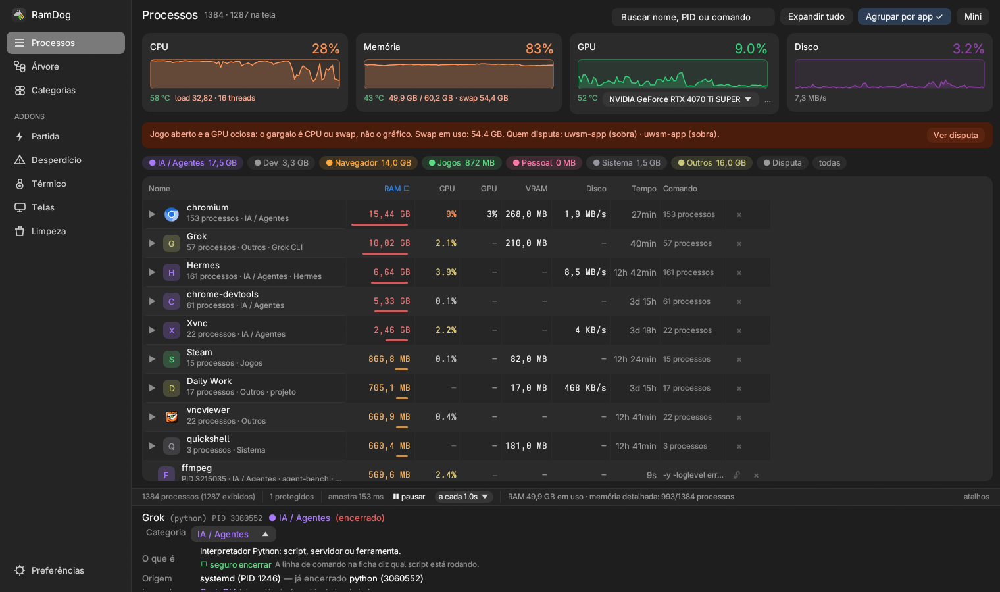

<p align="center">
  
</p>

<p align="center">
  <a href="https://lucasol1337.github.io/RamDog/">Site</a>
  ·
  <a href="https://lucasol1337.github.io/RamDog/guia.html">Guia completo</a>
  ·
  <a href="README.en.md">English</a>
  ·
  <a href="docs/releases/v0.12.1.md">Patch notes v0.12.1</a>
  ·
  <a href="CHANGELOG.md">Changelog</a>
</p>

<p align="center">
  
  
  
  
  
  
  
  
</p>

<p align="center">
  Gerenciador de processos para Windows, Linux e macOS: origem, categorias, kill de árvore.
  No Linux, o alvo de primeira classe é o <a href="https://omarchy.org/">Omarchy</a> — Arch com Hyprland.
</p>



<p align="center"><sub>Processos no Linux — Omarchy / Hyprland, NVIDIA RTX 4070 Ti SUPER. Agrupar por app ligado; o Emulador Android aparece como sobra.</sub></p>

## Por que existe

O Gerenciador de Tarefas não mostra a cadeia de origem — quem lançou o processo. Não classifica IA, Dev ou Navegador. Não mata a árvore inteira com lock no que não pode cair. Não trata o desperdício do Windows. No Linux, `htop` não organiza janelas no Hyprland, não fala com systemd e não sabe o que é um agente.

Este app existe por isso.

## Atualização v0.12.1

A **v0.12.1** é um patch de manutenção interna: separa o cache e as consultas da tabela da interface e amplia os testes de regressão. Filtros, ordenação, atualização sob o ponteiro e os recursos em português e inglês da v0.12.0 são preservados. Não há novas funções visuais nem ganho de desempenho medido.

- Cache e consulta de processos em módulos testáveis sem abrir a janela.
- 22 testes do modelo da tabela, incluindo transições sob hover, grupos, busca e critérios de ordenação.
- Suíte Linux: 101 testes aprovados, três integrações opt-in ignoradas.

Notas completas: [v0.12.1](docs/releases/v0.12.1.md) · [v0.12.0](docs/releases/v0.12.0.md) · [changelog](CHANGELOG.md).

## Feito para Omarchy

<p align="center">
  
</p>

O RamDog **apoia o Omarchy como desktop Linux de referência**. Não é um porte genérico que “também abre no Hyprland”: a sessão, as janelas e o inventário foram escritos contra essa pilha.

- **Sessão protegida.** Hyprland, UWSM e Quickshell não podem ser encerrados pelo RamDog. Entram na categoria Sistema.
- **Telas nativo.** Mapa de monitores, grades, cenários e retorno ao tiling via `hyprctl` e a API Lua do Hyprland 0.55+. A mensagem de incompatibilidade cita Omarchy pelo nome.
- **Wayland com NVIDIA.** O VSync explícito do eframe fica desligado no Linux — era o que travava o event loop ao ocultar a janela com EGL/Wayland.
- **Arch de verdade.** Ícones pelos `.desktop`, origem do pacote e SHA-256 contra o mtree local do pacman (comparação com o banco local, não assinatura).
- **systemd de usuário.** Partida e Desperdício leem serviços, sockets e timers. O `ramdog-launch` sobe o app numa unidade transitória, independente do terminal.
- **GPU da máquina.** NVIDIA via `nvidia-smi`; AMD/Intel via DRM/hwmon. A validação de referência usou RTX 4070 Ti SUPER + AMD integrada nesta mesma sessão Omarchy.

Outros desktops Linux continuam com processos, categorias, origem, kill, GPU, Partida/Desperdício e Térmico. Telas e “em primeiro plano” exigem Hyprland.

Detalhes, dependências e limites: [linux/README.md](linux/README.md).

## O que faz

### Idioma / Language

The interface starts in Portuguese for existing installs. Open **Preferências / Preferences** and choose **English** under **Idioma / Language**; the choice is saved in the RamDog config and applies to navigation, metrics, startup, screens, and addon entry points without changing existing settings. See the full [English README](README.en.md).

- **Origem / lançado por.** Coluna Origem = primeiro ancestral vivo que não seja host genérico (`cmd`, `bash`, `node`…). Quando a cadeia de pais morreu, o RamDog lê o ambiente herdado e mostra em roxo o agente (Claude Code + sessão + PID, Codex, Cursor Agent, Gemini CLI, Hermes…) e o host (Maestri, VS Code, Cursor, Windows Terminal…), além de `npm run <script>` no projeto.
- **Categorias.** IA / Agentes, Dev, Navegador, Jogos, Pessoal, Sistema, Outros — regra automática, com override manual por processo.
- **Kill, árvore e lock.** Finaliza o processo ou a árvore (processo + filhos). Lock impede que o RamDog encerre o protegido. Processos críticos do SO (`System`/`csrss`/`dwm` no Windows; `systemd`/`kthreadd`/`Hyprland`/`UWSM`/`Quickshell`/`gnome-shell`/`Xorg` no Linux; `kernel_task`/`launchd`/`WindowServer` no macOS) são sempre protegidos.
- **Visões.** Lista (plana), Árvore (pai → filhos, RAM da subárvore), Categorias (agrupado) nas abas ao lado da busca. Os addons — **Faxina**, **Partida**, **Desperdício**, **Térmico**, **Telas** e **Limpeza** — ficam longe delas, com o nome escrito no bloco de controles do canto superior direito: clicar troca o conteúdo da janela, clicar de novo volta para a lista de processos. No Linux: Partida e Desperdício usam systemd/XDG, Telas usa Hyprland, Térmico usa hwmon com controle autenticado de PWM, Faxina separa o que está aberto sem uso em pode fechar / talvez / em uso e fecha em massa o que você marcar, e Limpeza junta cache do kernel e zombies com disco (`~/.cache`, lixeira, pacman, journal, coredumps, órfãos). Veja [o porte Linux](linux/README.md).
- **Agrupar por app.** Na visão Lista, famílias reconhecidas (Claude, Codex, Grok, ChatGPT, Cursor, Gemini, Hermes, Maestri, OpenCode) e processos do mesmo executável viram uma linha só — `Claude (12)`, `chromium (66)` — somando RAM, CPU, GPU e disco no cabeçalho, com **✖** que encerra o app inteiro. O grupo **começa recolhido**; clica para ver os PIDs. A chave das famílias atravessa instalações versionadas (`mise`, PATH, pasta do ChatGPT) e o `node` lançado pelo agente. Fora delas, a chave é o caminho do executável, não o nome: dois `worker` de pastas diferentes nunca caem no mesmo grupo, e no Unix a diferença de maiúsculas conta. App com um processo só não agrupa.
- **Coluna CPU que dá para ler.** No Windows a repartição é por `CycleTime` (contado a cada troca de contexto), não pelo tempo de kernel/usuário — que o Windows só cobra em fatias de 15,625 ms e joga inteira em quem estava rodando no tique, fazendo processo de rajada piscar entre 0% e 15%. O total repartido vem de `GetSystemTimes`, então a máquina afogada não dilui o culpado. No Linux a conta sai de `/proc/*/stat` contra os núcleos online da máquina, não contra a afinidade do próprio RamDog. Nos dois, média móvel de τ = 1 s amarrada ao tempo: o topo da lista para quieto o tempo de você ler. O valor cru do último intervalo continua visível no tooltip.
- **Medidores.** CPU e RAM no topo nos três SOs. GPU NVIDIA via NVML no Windows; NVIDIA via nvidia-smi e AMD/Intel via DRM/hwmon no Linux. % de disco: PDH no Windows, `/proc/diskstats` no Linux, ausente no macOS.
- **Térmico.** No Windows, o [TempHUD](https://github.com/LucasOl1337/TempHUD) embutido: sensores de CPU/GPU/RAM/placa-mãe, controle de fans SuperIO (% manual ou Auto/BIOS) e **ESTABILIZAR** — fans travados em 50% até 80 °C, rampa linear até 100% aos 92 °C, teto imediato a 95 °C. A curva roda no helper `hwtemp.exe`: se o RamDog cair, os fans voltam à BIOS sozinhos. Fans exigem admin; sem eles a visão mostra só as leituras. No Linux lê `/sys/class/hwmon` e oferece PWM/ESTABILIZAR em controladores compatíveis, com helper autenticado que restaura o estado anterior ao encerrar.
- **Partida.** Tudo que sobe com o PC, não o recorte do Gerenciador de Tarefas: `Run` e `RunOnce` (HKCU, HKLM e Wow64), a pasta Iniciar inteira (`.lnk`, `.vbs`, `.cmd`), tarefas agendadas com gatilho de boot/logon, serviços automáticos, apps UWP, Winlogon e Active Setup. A lista não vem achatada: o corte de fora é **sobe com o PC / não sobe / quebrada** — três contadores clicáveis no topo — e, dentro de cada bloco, a **fase do arranque**, da superfície para o fundo: seus programas, ao entrar na conta, com a máquina, antes do Windows. Cada faixa diz quantas entradas tem e quantas estão rodando agora, e recolhe com um clique. Estado na partida e estado agora deixaram de ser a mesma coluna: o check responde "sobe com o PC", a coluna **Agora** responde "tem processo de pé". Dá para trocar o corte de dentro para tipo de origem, agrupar só por fase ou só por tipo, ou voltar para a lista plana. No Linux a mesma visão lê systemd (usuário e sistema) e autostart XDG.
- **Telas.** Mapa dos monitores em escala: arraste a janela de um monitor para outro, solte numa zona da grade (metades, terços, quadrantes, principal+2…) e ela encaixa. **Distribuir** espalha tudo que está num monitor pela grade escolhida. **Cenários** salvam o arranjo em fração da área de trabalho — não em pixel — então o preset sobrevive a troca de resolução, de escala e de monitor; ao aplicar, o que já está aberto é movido e o que falta é aberto e posicionado quando a janela aparece. No Linux o backend é Hyprland (Omarchy incluído).
- **O que é isso, posso matar?** Ficha de 80 processos do Windows no painel de detalhes: o que faz, por que está aberto e o risco de encerrar — 🟢 seguro, 🟡 o Windows reabre sozinho, 🔴 derruba a sessão.
- **Assinatura digital.** O signatário vem do certificado (`WinVerifyTrust`), não do `CompanyName` do arquivo — que qualquer impostor preenche com "Microsoft Corporation". Verificado sob demanda, só no processo selecionado, fora da amostragem. No Arch, o equivalente documentado é o SHA-256 do pacman contra o arquivo em disco.
- **Modo mini.** Botão **◱ Mini** encolhe o app num HUD sem bordas com CPU, RAM, GPU e disco em 2×2, cada um com sua temperatura, mais os RPM dos fans e o **ESTABILIZAR**. Fica por cima das outras janelas (alterna no `topo`), arrasta pelo fundo, minimiza, e o duplo clique volta ao app inteiro. O modo é lembrado entre sessões.

## Instalar

**Windows x64** (PowerShell):

```powershell
irm https://raw.githubusercontent.com/LucasOl1337/RamDog/main/install.ps1 | iex
```

Depois: `ramdog` no terminal, ou o atalho **RamDog** na área de trabalho.

O RamDog **pede elevação ao abrir** (um prompt de UAC, por qualquer caminho: atalho, PATH ou clique no exe). É o que destrava a temperatura de CPU/RAM, encerrar serviço e processo de outro usuário, e as ações do Partida e do Desperdício sem um UAC por clique. Quem não tem direito de elevar não fica de fora: o RamDog abre limitado em vez de recusar a subir (`highestAvailable`, não `requireAdministrator`).

**Linux** (x86_64 ou aarch64, incluindo Omarchy) e **macOS** (Apple Silicon ou Intel):

```bash
curl -sSfL https://raw.githubusercontent.com/LucasOl1337/RamDog/main/install.sh | sh
```

Baixa o tar do [release](https://github.com/LucasOl1337/RamDog/releases) (`RamDog-linux-x86_64.tar.gz`, `RamDog-linux-aarch64.tar.gz`, `RamDog-macos-aarch64.tar.gz` ou `…-x86_64.tar.gz`) para `~/.local/bin/ramdog` e abre. No Mac, se o Gatekeeper bloquear: Ajustes → Privacidade e segurança → Abrir mesmo assim.

No Linux: lista, categorias, origem, árvore, kill, USS/PSS/RSS, GPU, sensores e ventoinhas, Partida/Desperdício via systemd e Telas via Hyprland. A **v0.13.0** traz a Faxina; a v0.12 acrescentou a interface inglesa; a v0.11 trouxe contabilidade precisa, origens systemd e Disputa, e a v0.10 introduziu a interface atual e a Limpeza. Veja as [patch notes](docs/releases/v0.13.0.md) e o [changelog](CHANGELOG.md). Consulte [dependências e limites](linux/README.md). Janela: Wayland ou X11 (eframe). Os binários Linux requerem glibc 2.39+ (Ubuntu 24.04, Omarchy/Arch atual, ou distribuição compatível); em sistemas anteriores, compile do código. Sem binário no release, o script cai no `cargo build` (precisa [rustup](https://rustup.rs) + git e libs nativas, ver abaixo).

O instalador verifica SHA-256 e, no Linux, também instala `ramdog-launch`, que mantém o app independente do terminal usando systemd de usuário quando disponível. `RAMDOG_HOME` muda o destino, `RAMDOG_VERSION=v0.12.1` fixa a versão e `RAMDOG_NO_LAUNCH=1` instala sem abrir. Exemplo: `curl -sSfL https://raw.githubusercontent.com/LucasOl1337/RamDog/main/install.sh | RAMDOG_NO_LAUNCH=1 sh`.

No Mac: lista, categorias, origem, árvore, kill. Sem Desperdício, sem Telas, sem temp de CPU, sem GPU NVML.

[Release](https://github.com/LucasOl1337/RamDog/releases) com zip (Windows) e tar (Linux/macOS), se preferir baixar na mão.

Do código:

```bash
git clone https://github.com/LucasOl1337/RamDog.git
cd RamDog
cargo build --release
```

No Linux (Debian/Ubuntu e derivados), o `eframe` com Wayland/X11 precisa das libs de desenvolvimento:

```bash
sudo apt install build-essential pkg-config libxkbcommon-dev libwayland-dev \
  libx11-dev libxcursor-dev libxi-dev libxrandr-dev libgl1-mesa-dev
```

No Omarchy / Arch:

```bash
sudo pacman -S --needed base-devel rust pkgconf libxkbcommon wayland libx11 \
  libxcursor libxi libxrandr mesa
```

No Windows, o manifesto de elevação só entra no perfil `release` — ele vale para todos os
alvos do crate, e no binário de teste faria `cargo test` morrer com "a operação solicitada
requer elevação" antes de rodar um teste. `cargo test` (debug) roda normal; `cargo test
--release` precisa de sessão elevada.

Windows, helper de temperatura (opcional, [SDK .NET 8](https://dotnet.microsoft.com/download/dotnet/8.0)):

```bash
dotnet publish hwtemp -c Release -o target/release --no-self-contained
```

## Uso

| Ação | Como |
|---|---|
| Finalizar processo | ✖ na linha, `Del`, botão direito → Finalizar, ou painel inferior |
| Finalizar árvore (processo + filhos) | `Shift+Del`, `Shift`+✖, botão direito → Finalizar árvore, ou painel inferior |
| Proteger / desproteger | 🔒/🔓 na linha, botão direito, ou painel inferior. Protegidos nunca são finalizados pelo RamDog |
| Categoria manual | botão direito → Categoria, ou combo no painel inferior (`auto` volta à regra automática) |
| Visões | **Lista**, **Árvore**, **Categorias** nas abas ao lado da busca; **Partida**, **Desperdício**, **Térmico** e **Telas** com o nome escrito no bloco de controles do canto superior direito — o botão aceso é a visão atual e clicar nele volta para a última visão de processo. Partida/Desperdício/Telas/Térmico também implementados no Linux (systemd, Hyprland e hwmon) |
| Agrupar por app | caixa **Agrupar por app** na visão Lista; o grupo nasce recolhido, ▶/▼ abre os PIDs, **Expandir tudo** / **Recolher** valem para a lista inteira; **✖** no cabeçalho encerra todos os processos daquele app |
| Filtro | busca por nome / PID / comando; chips de categoria (clique alterna, duplo clique isola); `ocultar abaixo de N MB`, no canto direito da fileira junto de `coluna RAM mostra` |
| Origem | coluna *Origem* = primeiro ancestral vivo que não seja host genérico (cmd, bash, node...); cadeia completa clicável no painel inferior (`Ir para o pai`) |
| Lançado por | quando a cadeia de pais morreu (ou só tem hosts genéricos), o RamDog lê as variáveis de ambiente herdadas do processo e mostra em roxo quem o originou: agente (Claude Code + sessão + PID, Codex, Cursor Agent, Gemini CLI, Hermes...) e host (Maestri, VS Code, Cursor, Windows Terminal...), além de `npm run <script>` em `<projeto>` |
| Atualização | `⏸ pausar` e `a cada 0,5–5 s` no rodapé, ao lado do `amostra X ms` que eles produzem; `F5` força uma leitura |
| Modo mini | **◱ Mini** no canto superior direito. No HUD: `topo` alterna o sempre-por-cima, `–` minimiza, `⤢` (ou duplo clique no fundo) volta ao app inteiro, `✕` fecha; o botão de intervalo cicla 0,5 / 1 / 2 / 5 s; arrasta pelo fundo |

Encerrar é imediato: não há caixa de confirmação. Quem protege é o **lock** (🔒 no menu de contexto) — um processo travado não morre nem no `Del`, nem no ✖, nem no "finalizar árvore". E enquanto o mouse está sobre a tabela a ordem das linhas fica **congelada** (status "ordem congelada"), para o clique em ✖ nunca cair numa linha que acabou de trocar de lugar.

**Partida** (Windows): lista o que sobe no boot e no logon, com a origem de cada entrada (`Run`, pasta Iniciar, tarefa agendada, serviço, UWP, Winlogon, Active Setup), se já está rodando e o caminho real do executável. Ligar, desligar e remover valem para a entrada; o processo em si continua matável pela visão Lista. Entradas de máquina (HKLM, serviços, tarefas) precisam de admin — sem elevação o RamDog dispara um PowerShell elevado, **um prompt de UAC por ação**.

**Desperdício** (Windows): leitura direta (SCM + registro, sem PowerShell). **Ação** usa Win32 direto quando o RamDog já está elevado; senão dispara um PowerShell elevado — **um prompt de UAC por ação**. No macOS a visão existe só para dizer isso.

| Seção | O que dá para fazer | Reversível? |
|---|---|---|
| **Microsoft Defender** | Excluir pastas de projeto/agentes da varredura em tempo real (`Add-MpPreference -ExclusionPath`); limitar a CPU da varredura agendada para 5/10/20% (`-ScanAvgCPULoadFactor`); pausar/reativar a proteção em tempo real | Sim, tudo |
| **Serviços dispensáveis** | **Parar** (só agora) ou **Desativar** (não inicia mais) — WSearch, SysMain, DiagTrack, DoSvc, WerSvc, MapsBroker, PhoneSvc, Xbox*, lfsvc, RemoteRegistry, Fax. `wuauserv` é só *parar* (o Windows o religa sozinho) | Sim, botão **Reativar** |
| **Apps de sistema (Appx)** | Remover pacotes de sistema que você não usa | Reinstalável pela Store |
| **Inicialização** | Ligar/desligar entradas do `Run` (HKCU e HKLM) e **remover** de vez; **Finalizar** o processo se já estiver rodando | Ligar/desligar sim; remover, não |

**Telas** (Windows e Linux/Hyprland): o mapa desenha os monitores na proporção real, com a resolução de cada um e ★ no primário.

| Ação | Como |
|---|---|
| Mover janela de monitor | arraste o retângulo no mapa, ou os botões **→N** na lista (a fração ocupada é preservada no monitor de destino) |
| Encaixar na grade | com **encaixar ao arrastar** ligado, solte sobre a zona realçada da **Grade** escolhida (cheio, metades, deitadas, terços, quadrantes, principal+2, centro) |
| Distribuir | **Distribuir N** joga tudo que está no monitor N nas zonas da grade atual |
| Minimizar / maximizar | **—** e **▫** na lista de janelas abertas |
| Montar cenário | **+** na linha da janela adiciona o slot ao cenário selecionado; **Salvar atual** captura o arranjo inteiro; **Novo vazio** começa do zero |
| Aplicar cenário | **Aplicar** move o que já está aberto e, nos slots com **abrir** marcado, lança o que falta e posiciona quando a janela aparece (desiste após 25 s) |
| Casar a janela certa | **título contém…** desempata quando o mesmo executável tem várias janelas |

Os slots guardam posição em fração da **área de trabalho** do monitor, nunca em pixel — trocar de resolução, de escala ou de monitor não quebra o cenário. Se o monitor do slot sumiu, ele cai no primário. Ao posicionar no Windows, o RamDog desconta a sombra invisível da janela (`DWMWA_EXTENDED_FRAME_BOUNDS`), então metade da tela é metade de verdade, sem folga.

## O que cada sistema cobre

| | Windows | Omarchy / Hyprland | Outro Linux | macOS |
|---|---|---|---|---|
| Lista, árvore, categorias, origem, kill, lock | sim | sim | sim | sim |
| Agrupar por app / famílias de agentes | sim | sim | sim | sim |
| Partida | Run, tarefas, serviços, UWP… | systemd + XDG | systemd + XDG | — |
| Desperdício | Defender, serviços, Appx, Run | serviços systemd | serviços systemd | aviso |
| Telas | DWM / `SetWindowPos` | Hyprland nativo | — | aviso |
| Térmico | `hwtemp.exe` (admin) | hwmon + PWM autenticado | hwmon + PWM autenticado | — |
| GPU | NVIDIA (NVML) | NVIDIA / AMD / Intel | NVIDIA / AMD / Intel | — |
| Disco no topo | PDH `% Idle` | `/proc/diskstats` | `/proc/diskstats` | — |
| Integridade do exe | Authenticode | SHA-256 do pacman | SHA-256 do pacman (Arch) | — |

## Limites

**Os três SOs**

- Processos de outros usuários: no Windows já vem resolvido pela elevação de abertura (o botão **Reabrir como admin** só aparece quando ela foi recusada ou o usuário não pode elevar); no Linux, controles administrativos pedem autenticação própria e métricas de outros usuários podem aparecer como indisponíveis; no macOS, os acessos dependem das permissões da sessão. A UI nunca inventa número — GPU/temp/disco ausentes aparecem "–".
- Configuração: Windows `%APPDATA%\RamDog\config.json`; Linux `$XDG_CONFIG_HOME/RamDog/config.json` (ou `~/.config/RamDog/config.json`); macOS `~/Library/Application Support/RamDog/config.json`.

**Só Windows**

- Desperdício (Defender, serviços, Appx, inicialização).
- Telas: `EnumDisplayMonitors`, `EnumWindows`, `SetWindowPos` e o DWM (para descontar a sombra invisível da janela). No macOS o equivalente é a Accessibility API, que exige permissão explícita do sistema — a visão existe só para dizer isso.
- Partida: a leitura completa (HKLM, tarefas, serviços) sai sem admin; ligar/desligar/remover entrada de máquina exige elevação — o RamDog pede via UAC quando precisa.
- Assinatura digital: `WinVerifyTrust` só existe no Windows. No macOS o campo não aparece.
- Térmico: sensores e fans via helper `hwtemp.exe` (LibreHardwareMonitor). Sem admin, Tctl/DIMM/fans não aparecem; GPU NVIDIA lê mesmo assim. Só fans SuperIO da placa-mãe — a GPU fica na curva dela.
- Temperatura de CPU/RAM: helper `hwtemp.exe` (LibreHardwareMonitor), só elevado. Sem helper/admin/sensor, "–".
- GPU no topo e na tabela: **NVIDIA** (`nvml.dll`). Sem driver, "–".
- `MsMpEng.exe` é processo protegido pelo kernel: a seção Defender só reduz o trabalho dele, não mata. Com Tamper Protection ligada, pausar tempo real não pega.

**Só Linux**

- Partida/Desperdício: serviços systemd e autostart XDG, com presets de inicialização. Telas: Hyprland (Omarchy incluído), mapa, organização e cenários. Ícones via desktop entries; integridade SHA-256 via banco local do pacman (não é assinatura Authenticode).
- Térmico: hwmon (CPU, GPU, DIMM quando disponível), PWM manual/automático e ESTABILIZAR via helper autenticado; requer driver com escrita de PWM.
- Disco no topo: `%util` e bytes/s de `/proc/diskstats` (discos inteiros; partições/loop/zram de fora).
- Sem display (SSH puro, sem `WAYLAND_DISPLAY`/`DISPLAY`) a janela não abre.
- Precisa das libs X11/Wayland em tempo de execução (`libxkbcommon`, `libwayland`, `libX11`, GL).
- Binários do release: glibc 2.39+. Omarchy/Arch atual atende; distros mais antigas compilam do código.

**Só macOS**

- Sem Desperdício, sem Telas, sem temp de CPU, sem NVML. Disco no topo não tem % idle estilo Task Manager.
- Gatekeeper pode barrar o binário no primeiro open.

## Como mede

**Windows:** RAM = *Private Working Set* (`NtQuerySystemInformation`, mesma coluna Memória do Gerenciador de Tarefas). CPU no topo = `GetSystemTimes`; CPU por processo = fatia de `CycleTime` sobre a capacidade do mesmo `GetSystemTimes`, com média móvel de τ = 1 s (sem `CycleTime` — Windows antigo ou VM que zera o campo — cai no delta de kernel+user). Processo que morreu entre duas amostras fica fora dos dois lados da conta: os % dele somem da lista em vez de serem herdados por quem ficou. GPU = NVML + PDH `\GPU Engine(*)\Utilization Percentage` (máximo entre engines do PID). Disco no topo = PDH `% Idle Time` + bytes/s (`PdhAddEnglishCounterW`, nomes em inglês). `hwtemp.exe` lê Tctl/Tdie e DIMM.

**Linux:** sampler próprio em `/proc` — sem threads como processo, sem FD de `stat` preso. CPU via `utime+stime` contra os núcleos online, média de 1 s. A coluna mostra núcleos equivalentes (`1,6×`) quando o % da máquina esconderia o processo. Load (`/proc/loadavg`) e swap (`SwapTotal`/`SwapFree`) nos cards; a faixa e o chip **Disputa** sobem sobra de emulador, loop de `git-credential` e CPU com pouca RAM. RSS de `statm`; USS/PSS de `smaps_rollup` com cache; sem smaps, o privado é `RSS − shared`. Virtual por processo e commit global (`Committed_AS`/`CommitLimit`) são contadores distintos. Disco por processo via `/proc/PID/io`; topo via `/proc/diskstats`. GPU via nvidia-smi e DRM. [Detalhes](linux/README.md).

**macOS:** processos, RAM (RSS) e CPU via [sysinfo](https://crates.io/crates/sysinfo). Disco por processo = bytes lidos+escritos/s. Sem PDH, sem NVML, sem LibreHardwareMonitor.

## Licença

[MIT](LICENSE).

## Releases

[v0.12.1](docs/releases/v0.12.1.md) · [Changelog](CHANGELOG.md) · [Patch notes v0.12.0](docs/releases/v0.12.0.md) · [v0.11.1](docs/releases/v0.11.1.md) · [v0.11.0](docs/releases/v0.11.0.md) · [Como publicar com `./release`](docs/RELEASING.md).

A imagem de preview social do repositório está em [`docs/media/banners/og.png`](docs/media/banners/og.png) (1280×640).

## Também

[**TempHUD**](https://github.com/LucasOl1337/TempHUD) — overlay térmico para Windows.
