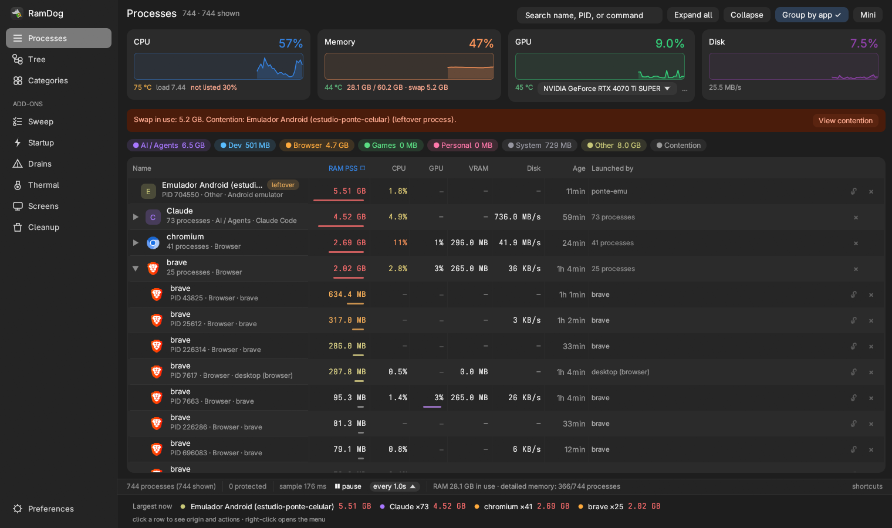
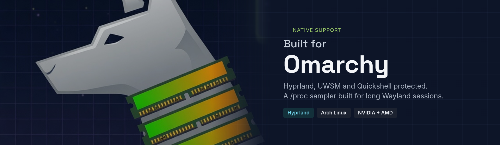
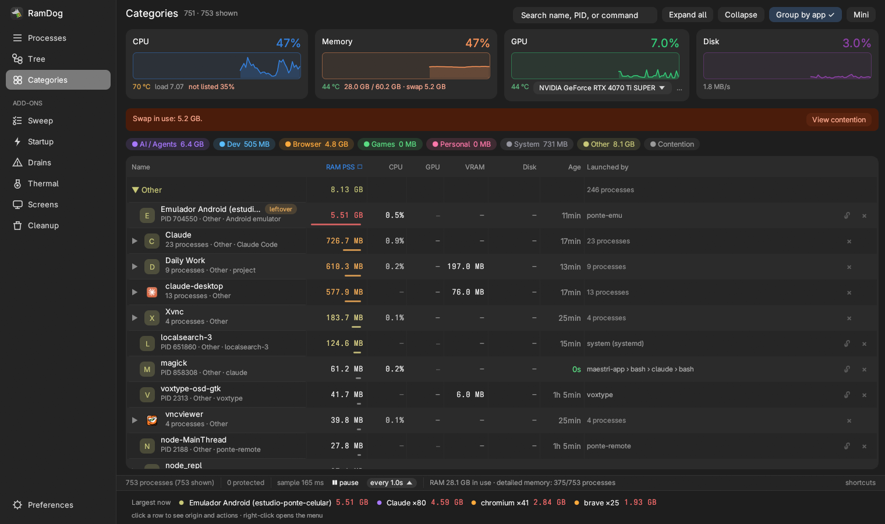
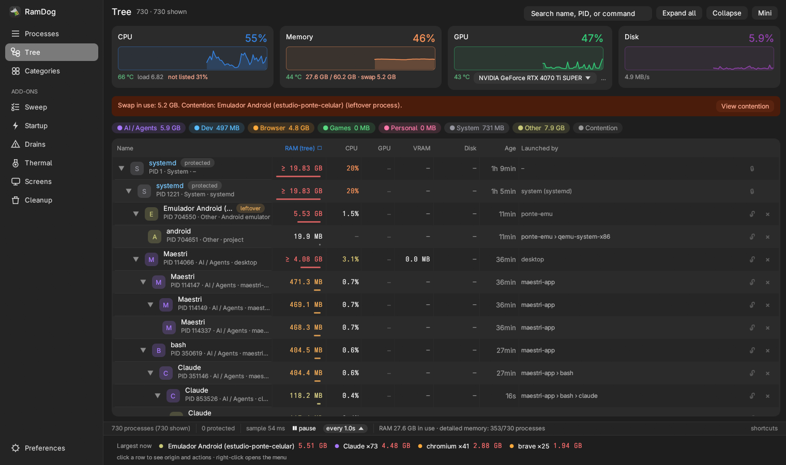
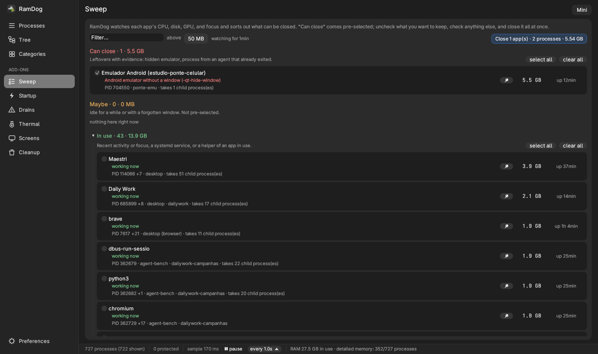
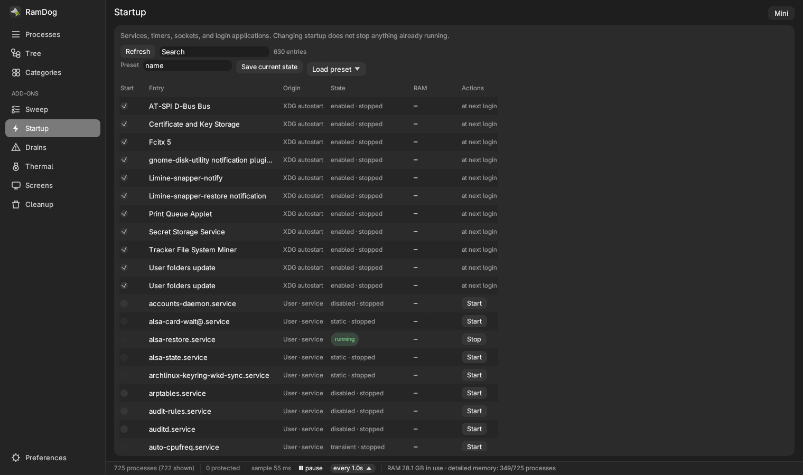
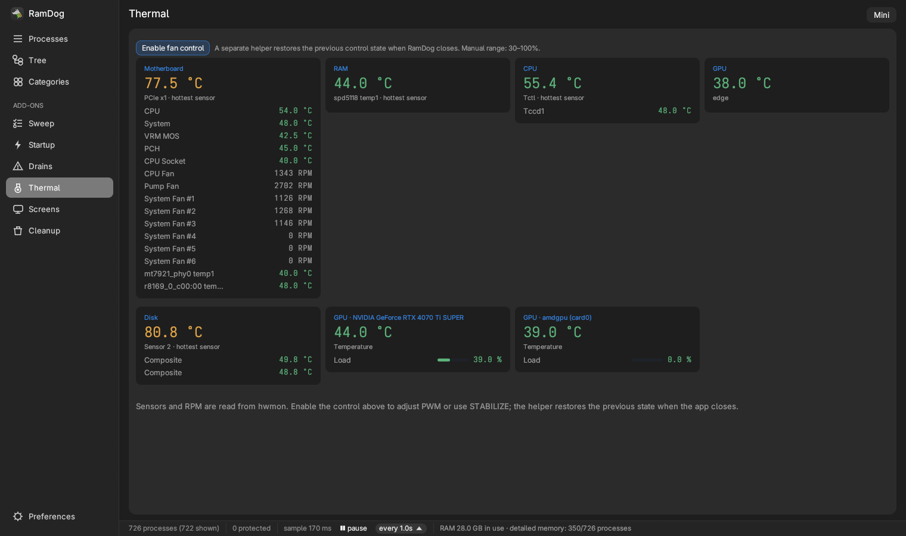
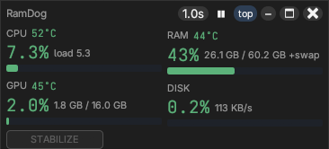
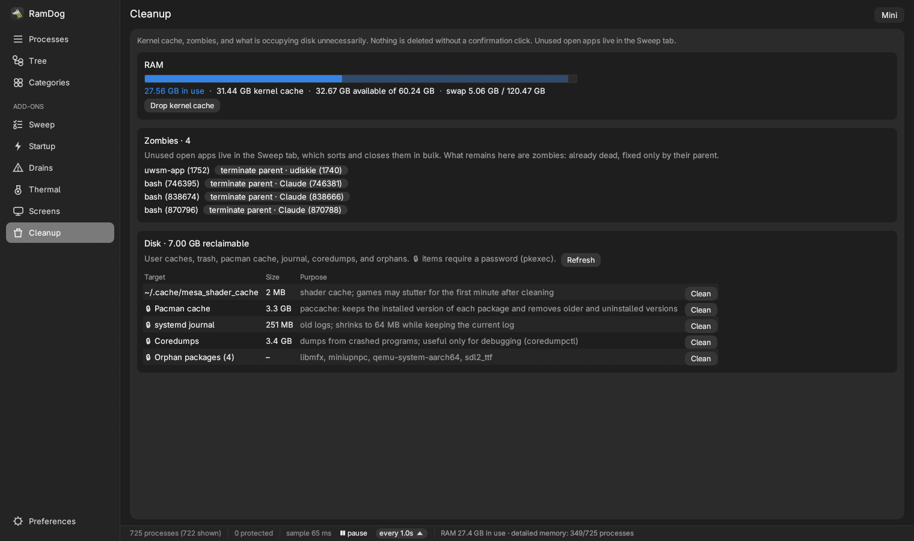

<p align="center">
  
</p>

<p align="center">
  <a href="https://github.com/LucasOl1337/RamDog/releases/latest"></a>
  <a href="https://github.com/LucasOl1337/RamDog/actions/workflows/release.yml"></a>
  
  
  
  <a href="LICENSE"></a>
</p>

<p align="center">
  <b>A process manager that answers "who is using my machine?"</b><br>
  Every app on one row. Memory numbers that add up. Where each process came from.
</p>

<p align="center">
  <a href="#install">Install</a> ·
  <a href="#built-for-omarchy">Omarchy</a> ·
  <a href="docs/reference.md">Reference</a> ·
  <a href="CHANGELOG.md">Changelog</a> ·
  <a href="CONTRIBUTING.md">Contributing</a> ·
  <a href="README.pt-BR.md">Português</a>
</p>



## Why RamDog

`htop` shows you 18 `brave` rows and 12 `claude` rows. Task Manager tells you the browser uses 3.6 GB when it really uses 1.8. Neither tells you that the `node` eating a core was started by an agent session that ended an hour ago.

RamDog was built for machines that run browsers, dev servers, AI coding agents and games at the same time:

- **One app, one row.** Browsers, Electron apps, agent CLIs and Python/Node projects are grouped with all their processes. Expand a group to see the PIDs, or close the whole app with one click.
- **Memory that adds up.** On Linux the RAM column uses PSS, which splits shared pages among the processes that use them. Group totals, category totals and the top meters match what the app really costs.
- **Where it came from.** The origin column follows the parent chain and inherited environment to name the terminal, agent (Claude Code, Codex, Cursor, Gemini, Hermes…), editor or `npm run` script behind a process, even after the parent is gone.
- **Safe to click.** Hyprland, UWSM, Quickshell, systemd and other session-critical processes cannot be killed. Lock anything else you want protected. Row order freezes under the pointer so you never kill the row that just moved.
- **Clean up what you forgot.** Sweep sorts open apps into *can close*, *maybe* and *in use* from what it observed, and closes your selection in bulk. Cleanup handles kernel cache, zombies, `~/.cache`, pacman cache and journal.
- **Native, small, fast.** A single Rust binary (egui), no Electron, no daemon. It reads `/proc` directly and stays light during long sessions.

## Install

**Omarchy, Arch and other Linux** (x86_64, aarch64) and **macOS** (Apple Silicon, Intel):

```sh
curl -sSfL https://raw.githubusercontent.com/LucasOl1337/RamDog/main/install.sh | sh
```

The script downloads the latest [release](https://github.com/LucasOl1337/RamDog/releases/latest), verifies its SHA-256, installs `ramdog` and `ramdog-launch` into `~/.local/bin`, adds a **RamDog** entry to your app launcher, and opens it. Nothing needs root.

**Windows x64** (PowerShell):

```powershell
irm https://raw.githubusercontent.com/LucasOl1337/RamDog/main/install.ps1 | iex
```

<details>
<summary>Options, AUR package, manual download and building from source</summary>

- `RAMDOG_VERSION=v0.14.0` pins a version, `RAMDOG_HOME=/path` changes the destination, `RAMDOG_NO_LAUNCH=1` installs without opening, and `RAMDOG_NO_DESKTOP=1` skips the launcher entry. Example: `curl -sSfL https://raw.githubusercontent.com/LucasOl1337/RamDog/main/install.sh | RAMDOG_NO_LAUNCH=1 sh`.
- **Arch / Omarchy package:** [`packaging/aur/ramdog-bin`](packaging/aur/ramdog-bin/PKGBUILD) builds a pacman package from the release binaries with `makepkg -si`.
- **Manual download:** the [release page](https://github.com/LucasOl1337/RamDog/releases/latest) has the Linux and macOS tarballs, the Windows zip and `SHA256SUMS.txt`.
- **Requirements:** Linux release binaries need glibc 2.39+ (current Arch/Omarchy, Ubuntu 24.04 or newer) and a Wayland or X11 session. On macOS, if Gatekeeper blocks the first run, use Settings → Privacy & Security → Open Anyway. The Windows thermal helper needs the .NET 8 runtime.
- **From source:**

  ```sh
  git clone https://github.com/LucasOl1337/RamDog.git && cd RamDog
  cargo build --locked --release   # binary at target/release/ramdog
  ```

  Build dependencies on Arch/Omarchy: `sudo pacman -S --needed base-devel rust pkgconf libxkbcommon wayland libx11 libxcursor libxi libxrandr mesa`. On Debian/Ubuntu and other systems, see the [Linux guide](linux/README.md#build-and-run).

</details>

The interface starts in your system language (English or Portuguese) and can be switched in **Preferences → Language**.

## Built for Omarchy

<p align="center">
  
</p>

[Omarchy](https://omarchy.org/) is RamDog's reference Linux desktop. The Linux build was written against Arch + Hyprland + UWSM + Quickshell + systemd, not ported to "also open" there.

- **Protected session.** Hyprland, UWSM and Quickshell are classified as System and can never be killed from RamDog.
- **Hyprland windows.** The Screens view draws your monitors to scale, moves windows across them, snaps to grids and saves scenes, through `hyprctl` and the Hyprland 0.55+ Lua API.
- **systemd and pacman.** Startup and Drains manage user and system units and XDG autostart. Cleanup knows the pacman cache, orphans and the journal. Executables are checked with SHA-256 against the local pacman database.
- **NVIDIA and AMD together.** GPU load and VRAM per process from `nvidia-smi` and DRM, on the same machine.
- **One instance.** `ramdog-launch` runs RamDog as a transient `ramdog.service`, detached from the terminal. Launching it again focuses the open window.

Bind it to a key. With Omarchy's Lua config, in `~/.config/hypr/bindings.lua`:

```lua
o.bind("SUPER + SHIFT + R", "RamDog", "ramdog-launch")
```

With the classic config, in `~/.config/hypr/bindings.conf`:

```ini
bindd = SUPER SHIFT, R, RamDog, exec, ramdog-launch
```

### Task manager mode

`ramdog-launch --gerenciador` opens a compact task-manager window next to the full app: open apps first, then background, then system (collapsed). Each row is one app with its processes summed, CPU and RAM in PSS, in your Omarchy theme colors. A terminal running an AI agent shows up as the agent and its project ("Claude · RamDog"), not as "foot". **Close** asks the window to close (or sends SIGTERM when there is no window); if the app is still there after 5 seconds, **Force quit…** kills the group after a confirmation. Protected processes are never touched. **Full list ↗** opens the main RamDog with that process selected.

It is a good fit for Omarchy's task manager key:

```lua
o.bind("SUPER + ALT + DELETE", "RamDog task manager", "ramdog-launch --gerenciador")
o.window({ class = "^ramdog-gerenciador$" }, { float = true, center = true, size = { 880, 580 } })
```

Keys: type to search, ↑/↓ to pick, Enter to show the app, Delete to close, Shift+Delete to force quit, Esc to leave.

Other Linux desktops get everything except Screens, which needs Hyprland. Details, dependencies and limits are in the [Linux guide](linux/README.md).

## A tour

| | |
|---|---|
| <br>**Categories.** AI / Agents, Dev, Browser, Games, Personal, System and Other, with apps grouped inside each one. Override any process manually. | <br>**Tree.** Parent → children with subtree RAM and CPU. Kill a whole tree with `Shift+Del`. |
| <br>**Sweep.** What is open but unused, with the reason on each row. Close the selection in one go. | <br>**Startup.** Everything that starts with your session: systemd units, XDG autostart, and on Windows the registry, tasks, services and UWP. |
| <br>**Thermal.** hwmon sensors and fan RPM. STABILIZE holds fans steady and ramps only when it gets hot, through an authenticated helper. | <br>**Mini mode.** A borderless HUD with CPU, RAM, GPU and disk, their temperatures and fan RPM. |
| <br>**Cleanup.** Kernel cache, zombies with their parents, `~/.cache`, trash, pacman cache, journal and orphans, each with a confirmation. | **Drains.** State, RAM and start/stop/enable/disable for systemd services (Defender, services, UWP and Run keys on Windows).<br><br>**Screens.** Your monitors drawn to scale: move windows between them, snap to grids and save scenes that survive resolution changes. Hyprland and Windows. |

## Platforms

| | Omarchy / Hyprland | Other Linux | Windows | macOS |
|---|---|---|---|---|
| Processes, tree, categories, origin, kill, lock | ✓ | ✓ | ✓ | ✓ |
| Group by app | ✓ | ✓ | ✓ | ✓ |
| Memory metric | PSS / USS / RSS | PSS / USS / RSS | Working set / private / commit | RSS |
| Sweep and Cleanup | ✓ | ✓ | – | – |
| Startup and Drains | systemd + XDG | systemd + XDG | Registry, tasks, services, UWP, Defender | – |
| Screens | ✓ (Hyprland) | – | ✓ | – |
| Thermal and fans | hwmon + PWM | hwmon + PWM | LibreHardwareMonitor helper | – |
| GPU per process | NVIDIA, AMD, Intel | NVIDIA, AMD, Intel | NVIDIA | – |

Linux is the most complete platform and Omarchy is where releases are tested by hand. Windows has its own native backends. macOS covers the core process views. The [reference](docs/reference.md) lists every feature and limit per system.

## How RamDog counts memory

A browser runs a dozen processes that share libraries and memory. **RSS** counts every shared page again in each process, so adding them up overstates the total: in one measurement, 20 Brave processes summed 3.6 GB in RSS and 1.8 GB in PSS. **PSS** divides each shared page among the processes that map it, so the numbers add up across a group, a category and the whole machine. That is RamDog's default on Linux. **USS** (private) and **RSS** are one click away in the RAM column.

The kernel only exposes PSS for your own processes. Root and other users' processes show `—`, and a total that includes them is marked `≥`. RamDog never fills a missing reading with an invented number.

## Documentation

- [Reference](docs/reference.md): every view, shortcut, action and limit, per operating system.
- [Linux guide](linux/README.md): Omarchy integration, memory and GPU sources, sensors and PWM, logs and validation.
- [Changelog](CHANGELOG.md) and [release notes](docs/releases/).
- [Releasing](docs/RELEASING.md): how maintainers publish a version.

## Contributing

Bug reports, hardware reports (sensors, GPUs, compositors) and pull requests are welcome, in English or Portuguese. Start with [CONTRIBUTING.md](CONTRIBUTING.md). Security issues go through [SECURITY.md](SECURITY.md), not public issues. Everyone taking part follows the [Code of Conduct](CODE_OF_CONDUCT.md).

## License

[MIT](LICENSE). The Windows thermal helper uses [LibreHardwareMonitor](https://github.com/LibreHardwareMonitor/LibreHardwareMonitor) (MPL-2.0).

Also by the author: [TempHUD](https://github.com/LucasOl1337/TempHUD), a thermal overlay for Windows.
