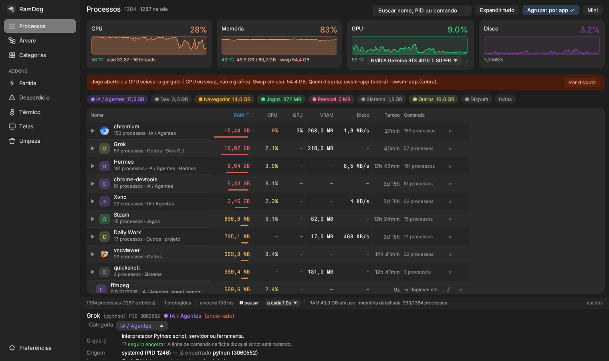
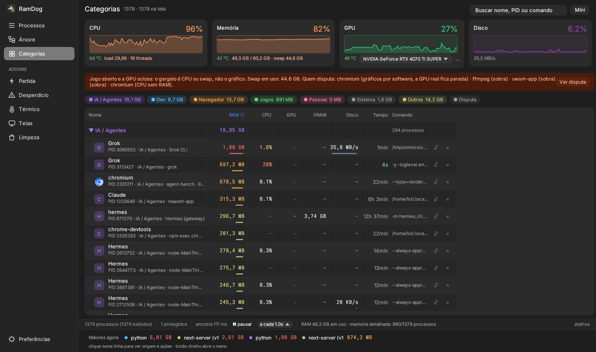
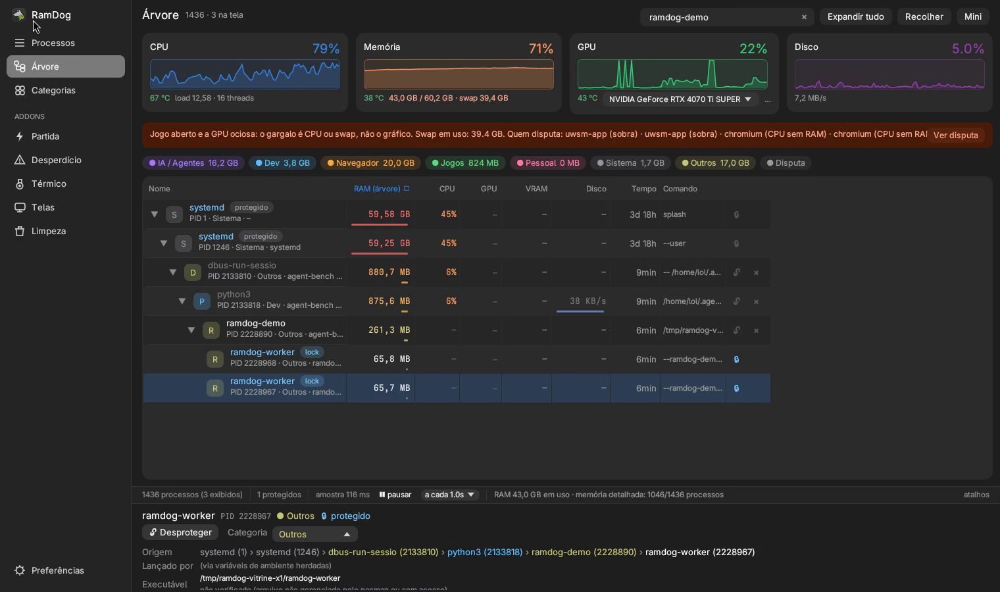
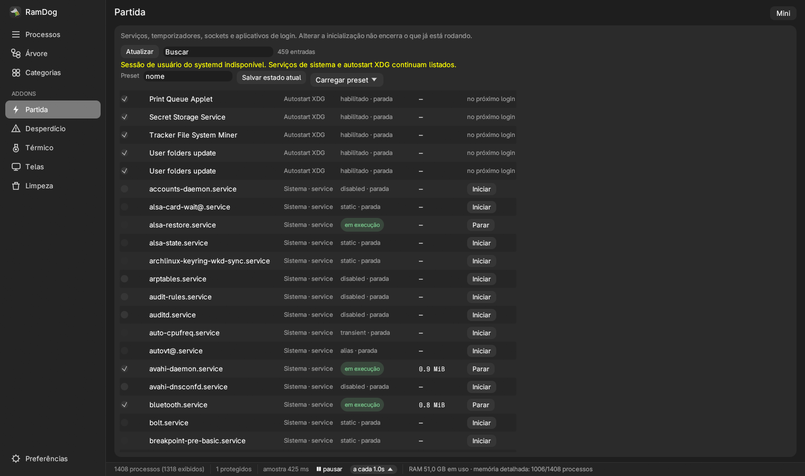
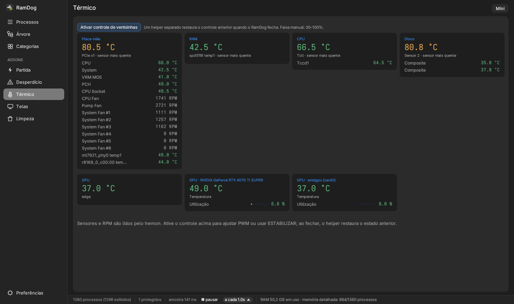
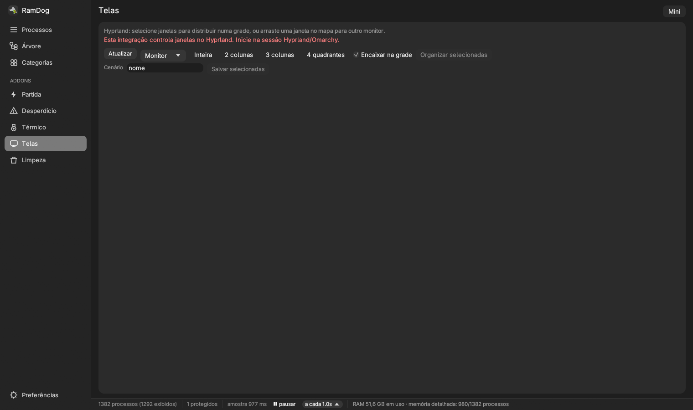
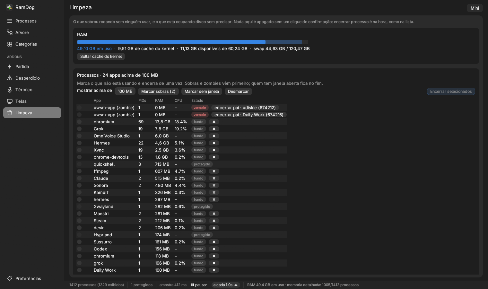

<p align="center">
  
</p>

<p align="center">
  <a href="https://github.com/LucasOl1337/RamDog/releases/latest"></a>
  <a href="https://github.com/LucasOl1337/RamDog/actions/workflows/release.yml"></a>
  
  
  <a href="LICENSE"></a>
</p>

<p align="center">
  <b>Um gerenciador de processos que responde "quem está usando minha máquina?"</b><br>
  Cada app numa linha. Números de memória que batem. De onde veio cada processo.
</p>

<p align="center">
  <a href="README.md">English</a> ·
  <a href="#instalar">Instalar</a> ·
  <a href="#feito-para-o-omarchy">Omarchy</a> ·
  <a href="linux/README.pt-BR.md">Guia Linux</a> ·
  <a href="docs/reference.md">Referência (EN)</a> ·
  <a href="CHANGELOG.md">Changelog</a>
</p>



## Por que o RamDog

O `htop` mostra 18 linhas de `brave` e 12 de `claude`. O Gerenciador de Tarefas diz que o navegador usa 3,6 GB quando usa 1,8. Nenhum dos dois conta que aquele `node` comendo um núcleo foi aberto por uma sessão de agente que acabou faz uma hora.

O RamDog foi feito pra máquina que roda navegador, dev server, agente de IA e jogo ao mesmo tempo:

- **Um app, uma linha.** Navegadores, apps Electron, CLIs de agente e projetos Python/Node viram um grupo com todos os processos. Expande pra ver os PIDs ou fecha o app inteiro num clique.
- **Memória que bate.** No Linux a coluna RAM usa PSS, que divide as páginas compartilhadas entre quem as usa. Grupo, categoria e medidores somam o que o app custa de verdade.
- **De onde veio.** A coluna de origem segue a cadeia de pais e o ambiente herdado e mostra o terminal, agente (Claude Code, Codex, Cursor, Gemini, Hermes…), editor ou script `npm run` por trás do processo, mesmo depois que o pai morreu.
- **Seguro de clicar.** Hyprland, UWSM, Quickshell, systemd e outros processos da sessão não morrem pelo RamDog. Tranque o que mais quiser proteger. A ordem das linhas congela sob o ponteiro, então você nunca mata a linha que acabou de mudar de lugar.
- **Limpa o que ficou esquecido.** A Faxina separa os apps abertos em *pode fechar*, *talvez* e *em uso* pelo que observou e fecha a seleção de uma vez. A Limpeza cuida de cache do kernel, zumbis, `~/.cache`, cache do pacman e journal.
- **Nativo, pequeno, rápido.** Um binário Rust (egui), sem Electron e sem daemon. Lê o `/proc` direto e fica leve em sessão longa.

## Instalar

**Omarchy, Arch e outros Linux** (x86_64, aarch64) e **macOS** (Apple Silicon, Intel):

```sh
curl -sSfL https://raw.githubusercontent.com/LucasOl1337/RamDog/main/install.sh | sh
```

O script baixa a [release](https://github.com/LucasOl1337/RamDog/releases/latest) mais recente, confere o SHA-256, instala `ramdog` e `ramdog-launch` em `~/.local/bin`, cria a entrada **RamDog** no lançador de apps e abre. Nada precisa de root.

**Windows x64** (PowerShell):

```powershell
irm https://raw.githubusercontent.com/LucasOl1337/RamDog/main/install.ps1 | iex
```

Opções (`RAMDOG_VERSION`, `RAMDOG_HOME`, `RAMDOG_NO_LAUNCH=1`, `RAMDOG_NO_DESKTOP=1`), o pacote Arch em [`packaging/aur/ramdog-bin`](packaging/aur/ramdog-bin/PKGBUILD), requisitos e build do código estão no [README em inglês](README.md#install) e no [guia Linux](linux/README.pt-BR.md).

A interface abre no idioma do sistema (português ou inglês) e troca em **Preferências → Idioma**.

## Feito para o Omarchy

<p align="center">
  
</p>

O [Omarchy](https://omarchy.org/) é o desktop Linux de referência do RamDog. A versão Linux foi escrita pra Arch + Hyprland + UWSM + Quickshell + systemd, não portada pra "também abrir" lá.

- **Sessão protegida.** Hyprland, UWSM e Quickshell são Sistema e nunca morrem pelo RamDog.
- **Janelas do Hyprland.** Telas desenha os monitores em escala, move janelas entre eles, encaixa em grades e salva cenas, via `hyprctl` e a API Lua do Hyprland 0.55+.
- **systemd e pacman.** Partida e Desperdício cuidam das units de usuário e sistema e do autostart XDG. A Limpeza conhece o cache do pacman, os órfãos e o journal. Executáveis são conferidos por SHA-256 contra o banco local do pacman.
- **NVIDIA e AMD juntas.** Carga e VRAM de GPU por processo via `nvidia-smi` e DRM, na mesma máquina.
- **Uma instância.** O `ramdog-launch` roda o RamDog como `ramdog.service` transitório, solto do terminal. Chamar de novo foca a janela aberta.

Põe num atalho. Na config Lua do Omarchy, em `~/.config/hypr/bindings.lua`:

```lua
o.bind("SUPER + SHIFT + R", "RamDog", "ramdog-launch")
```

Na config clássica, em `~/.config/hypr/bindings.conf`:

```ini
bindd = SUPER SHIFT, R, RamDog, exec, ramdog-launch
```

### Modo Gerenciador

`ramdog-launch --gerenciador` abre uma janela enxuta de gerenciador de tarefas, ao lado do app completo: primeiro os apps abertos, depois o segundo plano e o sistema (recolhido). Cada linha é um app com os processos somados, CPU e RAM em PSS, nas cores do tema do Omarchy. Terminal rodando agente de IA aparece como o agente e o projeto ("Claude · RamDog"), não como "foot". **Fechar** pede pra janela fechar (ou manda SIGTERM quando não tem janela); se o app continuar lá depois de 5 segundos, **Forçar…** mata o grupo depois de uma confirmação. Processo protegido nunca é tocado. **Lista completa ↗** abre o RamDog principal com o processo selecionado.

Cai bem no atalho do gerenciador de tarefas do Omarchy:

```lua
o.bind("SUPER + ALT + DELETE", "RamDog Gerenciador", "ramdog-launch --gerenciador")
o.window({ class = "^ramdog-gerenciador$" }, { float = true, center = true, size = { 880, 580 } })
```

Teclas: digite pra buscar, ↑/↓ pra escolher, Enter mostra o app, Delete fecha, Shift+Delete força, Esc sai.

## Um passeio

| | |
|---|---|
| <br>**Categorias.** IA / Agentes, Dev, Navegador, Jogos, Pessoal, Sistema e Outros, com os apps agrupados dentro. | <br>**Árvore.** Pai → filhos com RAM e CPU da subárvore. Mata a árvore inteira com `Shift+Del`. |
| <br>**Partida.** Tudo que sobe com a sessão: units do systemd, autostart XDG e, no Windows, registro, tarefas, serviços e UWP. | <br>**Térmico.** Sensores hwmon e RPM. O ESTABILIZAR segura as ventoinhas e só acelera quando esquenta, por um helper autenticado. |
| <br>**Telas.** Mapa dos monitores, grades e cenas no Hyprland (e no Windows). | <br>**Limpeza.** Cache do kernel, zumbis com seus pais, `~/.cache`, lixeira, pacman, journal e órfãos, tudo com confirmação. |

## Como o RamDog conta memória

Um navegador roda uma dúzia de processos que dividem bibliotecas e memória. O **RSS** conta cada página compartilhada de novo em cada processo, então a soma exagera: numa medição, 20 processos do Brave somaram 3,6 GB em RSS e 1,8 GB em PSS. O **PSS** divide cada página compartilhada entre os processos que a usam, então os números batem no grupo, na categoria e na máquina toda. É o padrão do RamDog no Linux; **USS** (privada) e **RSS** estão a um clique na coluna RAM.

O kernel só expõe PSS dos seus próprios processos. Os de root e de outros usuários aparecem com `—`, e um total que os inclui leva `≥`. O RamDog nunca preenche leitura faltando com número inventado.

## Contribuir

Relatos de bug, de hardware (sensores, GPUs, compositores) e pull requests são bem-vindos, em português ou inglês. Comece pelo [CONTRIBUTING.md](CONTRIBUTING.md). Falhas de segurança vão pelo [SECURITY.md](SECURITY.md), não por issue pública. Todo mundo segue o [Código de Conduta](CODE_OF_CONDUCT.md).

## Licença

[MIT](LICENSE). O helper térmico do Windows usa o [LibreHardwareMonitor](https://github.com/LibreHardwareMonitor/LibreHardwareMonitor) (MPL-2.0).
